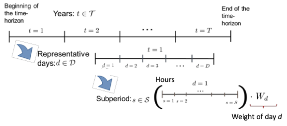

# Overview  
GTEP is an open source software package implemented using Python/pyomo for generation and transmission expansion planning (GTEP) in power systems. GTEP includes a mixed-integer linear programming (MILP) model that considers both the long term investment decisions and the hourly unit commitment decisions. Several algorithms including Benders decomposition, nested Benders decomposition, are implemented.
  
The models and algorithms of GTEP are based on [Lara et al (2018)](https://www.sciencedirect.com/science/article/pii/S0377221718304466), [Li et al (2021)](https://www.sciencedirect.com/science/article/pii/S0377221721005397), and [Li et al (2021)](https://www.sciencedirect.com/science/article/pii/S0142061521009248).

 
We are given different types of existing and known generating units and the generating units' nameplate (maximum) capacity; expected lifetime; fixed and variable operating costs; fixed and variable start-up cost; cost for extending their lifetimes; emission factor and carbon tax, if applicable; fuel price, if applicable; and operating characteristics such as ramp-up/ramp-down rates, operating limits, contribution to spinning and quick start fraction for thermal generators, and capacity factor for renewable generators. Also given are existing and candidate transmission lines between any of the two neighboring buses. The susceptance, distance, and capacity of each transmission line are known. We use DC power flow equations to calculate the power flow in each transmission line. These equations are built based on Kirchhoff's voltage and current laws. 
 
With the above input data, the proposed GTEP model is to decide: a) when and where to install new generators, storage units and transmission lines; b) when to retire generators and storage units; c) whether or not to extend the life of the generators that reached their expected lifetime; d) unit commitment of the thermal generators during the representative days; e) power generation of the generator clusters and power flows through the transmission lines. The objective is to minimize the overall cost including operating, investment, and environmental costs (e.g., carbon tax and renewable generation quota).  
                                                                                                                        
# Installation
CPLEX has to be installed to run the Bender algorithm. Installation instructions can be found [here](https://or.stackexchange.com/questions/4366/downloading-and-setting-up-cplex-for-pyomo)

The required python package can be found in requirements.txt. To install on linux, type
```
pip install -r requirements.txt
```
# User Interface
In order to solve with a given algorithm, run the following line of code in run.py

```python
from gtep import *
newinstance = GTEP(repn_day_method="input", time_limit=100000, tee=True, algo="fullspace", clustering_algorithm = "kmeans", num_repn_days=15, time_horizon=5, formulation="improved")
newinstance.solve_model()
newinstance.write_gtep_results()
```

The options can be given as arguments of GTEP.

The descriptions and default values of each option can be found in the following table.

| Argument                                 | Default                      | Domain                                                                                 | Description                                                             |
|------------------------------------------|------------------------------|----------------------------------------------------------------------------------------|-------------------------------------------------------------------------|
| region                                   | "ERCOT"                      | In(["ERCOT"])                                                                          | The region where the GTEP model is solved, currently only support ERCOT |
| time\_horizon                             | 5                            | In(list(range(1,21)))                                                                  | planning horizon of the GTEP model (from 1 to 20)                       |
| num\_repn\_days                            | 10                           | PositiveInt                                                                            | The number of representative days to be used for the GTEP model         |
| formulation                              | "improved"                   | In(["improved", "hull", "standard"])                                                   | formulation for the transmission expansion                              |
| algo                                     | "benders"                    | In(["benders", "nested\_benders", "fullspace"])                                         | solution algorithm                                                      |
| clustering\_algorithm                     | "kmeans"                     | In(["kmeans", "kmedoid", "kmeans\_exact", "kmedoid\_exact"])                             | cluster algorithm                                                       |
| max\_extreme\_day                          | 8                            | PositiveInt                                                                            | max number of extreme days added                                        |
| extreme\_day\_method                       | "load\_shedding\_cost"         | In(["highest\_cost\_infeasible", "highest\_cost", "load\_shedding\_cost", "kmedoid\_exact"]) | extreme day selection method                                            |
| repn\_day\_method                          | "input"                      | In(["input", "cost"])                                                                  | representative day selection method                                     |
| print\_level                              | 3                            | In([0, 1, 2,3,4])                                                                      | print level of log                                                      |
| solver                                   | "cplex"                      | In(["cplex", "gurobi", "cbc"])                                                         | solver                                                                  |
| time\_limit                               | 36000                        | PositiveFloat                                                                          | Time limit (seconds, default=36000)                                     |
| benders\_mip\_gap                          | 5e-3                         | PositiveFloat                                                                          | relative optimality gap for benders decomposition                       |
| nested\_benders\_iter\_limit                | 100                          | PositiveInt                                                                            | iteration limit for nested Benders                                      |
| nested\_benders\_relax\_integrality\_forward | 1                            | In([0,1])                                                                              | whether to relax integrality in the nested bender forward pass          |
| nested\_benders\_rel\_gap                   | 0.01                         | PositiveFloat                                                                          | relative optimality gap for nested Benders                              |
| threads                                  | 1                            | PositiveInt                                                                            | number of threads                                                       |
| solver\_options                           |                              | bool                                                                                   | options passed to the solver                                            |
| tee                                      | False                        | bool                                                                                   | Stream solver output to terminal.                                       |
| write\_gtep\_results                       | True                         | bool                                                                                   | Boolean varaible whether to write gtep results to a csv file            |
| logger                                   | idaeslog.getLogger(\_\_name\_\_) |                                                                                        | The logger object or name to use for reporting.                         |##Input data 


# Documentation
## Spatial and Temporal Simplification
Given is a geographical region with existing and potential generating units and transmissions lines. The problem consists in making capacity expansion decisions for both generation and transmission while considering the unit commitment and power flow constraints at the operational level.

### Generation representation

* For the existing generators we consider: (a) coal: steam turbine (coal-st-old); (b) natural gas: boiler plants with steam turbine (ng-st-old), combustion turbine (ng-ct-old), and combined-cycle (ng-cc-old); (c) nuclear: steam turbine (nuc-st-old); (d) solar: photo-voltaic (pv-old); (e) wind: wind turbine (wind-old).
* For the potential generators we consider: (a) coal: without (coal-new) and with carbon capture (coal-ccs-new); (b) natural gas: combustion turbine (ng-ct-new), combined-cycle without (ng-cc-new) and with carbon capture (ng-cc-ccs-new); (c) nuclear: steam turbine (nuc-st-new); (d) solar: photo-voltaic (pv- new) and concentrated solar power (csp-new); (e) wind: wind turbine (wind-new).

Also known are: the generating units' nameplate (maximum) capacity; expected lifetime; fixed and variable operating costs; fixed and variable start-up cost; cost for extending their lifetimes;  emission factor and carbon tax, if applicable; fuel price, if applicable; and operating characteristics such as ramp-up/ramp-down rates, operating limits, contribution to spinning and quick start fraction for thermal generators, and capacity factor for renewable generators.

For the case of existing generators, their age at the beginning of the study horizon and location are also known. For the case of potential generators, the capital cost and the maximum yearly installation of each generation technology are also given. Also given is a set of potential storage units, with specified technology (e.g., lithium ion, lead-acid, and flow batteries), capital cost, power rating, rated energy capacity, charge and discharge efficiency, and storage lifetime. Additionally, the projected load demand is given for each location.

We assume that the generators using the same type of technology are homogeneous, i.e., their design parameters are identical. For example, all the coal-st-old generators have the same parameters, which can be obtained by performing aggregation on the existing generators that use coal steam turbines. Note that although the renewable generators of the same technology have the same design parameters under our assumption, they can have different capacity factors depending on the weather conditions of the region in which they are installed. 
### Transmission representation
Given are existing and candidate transmission lines between any of the two neighboring buses. The susceptance, distance, and capacity of each transmission line are known. For the existing transmission lines, we assume that they will not reach their life expectancy during the planning horizon, i.e., we do not consider the retirement of transmission lines. For the candidate transmission lines, the capital cost of each transmission line is known. 
 
We use DC power flow equations to calculate the power flow in each transmission line. These equations are built based on Kirchhoff's voltage and current laws.

### Temporal representation
The GTEP model integrates unit commitment decisions to evaluate the hourly operation requirements. Given that the planning horizon of the GTEP problem can be as long as 10 to 30 years, solving the long-term planning problem with operating decisions in every hour of the planning horizon is intractable. Therefore, a simplification is needed to make the problem solvable, while representing the hourly fluctuations of the load and renewable profiles. We use representative days approach for time representation.

### Spatial representation
GTEP is typically performed on large scale power systems which consists of thousands of buses, such as ERCOT, SPP, PJM, MISO, etc. In most cases, it is intractable for GTEP to model each bus.  To reduce the spatial complexity of the problem. The area of interest is divided into several regions that have similar climate (e.g., wind speed and solar incidence over time), and load profiles. As we describe in the generation representation subsection, all the generators using the same technology have the same parameters. On the other hand, for the renewable generators, the capacity factors are dependent on the location at which they are installed. We assume that the capacity factors of the renewable generators in the same region are the same. 


 
We assume that all the generators and loads are located at the center of each region. Since each region is treated as one bus in the power flow model, we only consider the tielines between two neighboring regions. We assume that the two ends of each tieline are the centers of the two regions it connects. All the tielines are assumed to have the same voltage, susceptance, and capacity. An example of the proposed spatial representation approach is shown in the figure below. The ERCOT region is divided into five regions, Panhandle, Northeast, West, South, and Coast. The center of each region is specified as one of the cities in the region. The existing transmission lines are represented as solid lines while the candidate transmission lines are represented as dashed lines. Each region has generator clusters corresponding to different technologies. 
The aggregation of the generating units is a simplification of the problem that may yield suboptimal solution compared with modeling each generator individually. Such simplification is necessary to make the problem tractable. In order to obtain a feasible solution to the real physical system, i.e., the unit commitment decisions of each generator, one could perform a disaggregation heuristics on the aggregated solution.  We will leave developing these heuristics as future work.
 

### Decisions and objective
With the above input data, spatial and temporal representations, the proposed GTEP model is to decide: a) when and where to install new generators, storage units and transmission lines; b) when to retire generators and storage units; c) whether or not to extend the life of the generators that reached their expected lifetime; d) unit commitment of the thermal generators during the representative days; e) power generations of the generator clusters and power flows through the transmission lines. The objective is to minimize the overall cost including operating, investment, and environmental costs (e.g., carbon tax and renewable generation quota).

## input data

| Set notation    | definition                                | Example                                                                                                                                                                                                                       |
|-----------------|-------------------------------------------|-------------------------------------------------------------------------------------------------------------------------------------------------------------------------------------------------------------------------------|
|         m.r     |  regions                                  | ['Northeast', 'West', 'Coastal', 'South', 'Panhandle']                                                                                                                                                                        |
|         m.i     |  generators                               |    ['coal-st-old1', 'ng-ct-old', 'ng-cc-old', 'ng-st-old', 'pv-old', 'wind-old',  'wind-new', 'pv-new', 'csp-new', 'coal-igcc-new', 'coal-igcc-ccs-new', 'ng-cc-new', 'ng-cc-ccs-new', 'ng-ct-new','nuc-st-old','nuc-st-new'] |
|         m.th    |  thermal generators                       | ['coal-st-old1', 'coal-igcc-new', 'coal-igcc-ccs-new','ng-ct-old', 'ng-cc-old', 'ng-st-old', 'ng-cc-new', 'ng-cc-ccs-new','ng-ct-new','nuc-st-old', 'nuc-st-new']                                                             |
|         m.rn    |  renewable generators                     | ['pv-old', 'pv-new', 'csp-new', 'wind-old', 'wind-new']                                                                                                                                                                       |
|         m.co    |  coal-based generators                    | ['coal-st-old1', 'coal-igcc-new', 'coal-igcc-ccs-new']                                                                                                                                                                        |
|         m.ng    |  natural gas (NG) generators              | ['ng-ct-old', 'ng-cc-old', 'ng-st-old', 'ng-cc-new', 'ng-cc-ccs-new', 'ng-ct-new']                                                                                                                                            |
|         m.nu    |  nuclear generators                       | ['nuc-st-old', 'nuc-st-new']                                                                                                                                                                                                  |
|         m.pv    |  solar photovoltaic generators            | ['pv-old', 'pv-new']                                                                                                                                                                                                          |
|         m.csp   |  concentrated solar panels                | ['csp-new']                                                                                                                                                                                                                   |
|         m.wi    |  wind turbines                            | ['wind-old', 'wind-new']                                                                                                                                                                                                      |
|         m.old   |  subset of existing generators            | ['coal-st-old1', 'ng-ct-old', 'ng-cc-old', 'ng-st-old', 'pv-old','wind-old','nuc-st-old']                                                                                                                                     |
|         m.new   |  subset of potential generators           | ['wind-new', 'pv-new', 'csp-new', 'coal-igcc-new','coal-igcc-ccs-new', 'ng-cc-new', 'ng-cc-ccs-new', 'ng-ct-new','nuc-st-new']                                                                                                |
|         m.rold  |  subset of existing renewable generators  | ['pv-old', 'wind-old']                                                                                                                                                                                                        |
|         m.rnew  |  subset of potential renewable generators | ['wind-new', 'pv-new', 'csp-new']                                                                                                                                                                                             |
|         m.told  |  subset of existing thermal generators    | ['coal-st-old1', 'ng-ct-old', 'ng-cc-old', 'ng-st-old','nuc-st-old']                                                                                                                                                          |
|         m.tnew  |  subset of potential thermal generators   | ['coal-igcc-new', 'coal-igcc-ccs-new', 'ng-cc-new','ng-cc-ccs-new', 'ng-ct-new','nuc-st-new']                                                                                                                                 |
|         m.j     |  clusters of potential storage unit       | ['Li\_ion', 'Lead\_acid', 'Flow']                                                                                                                                                                                               |
|         m.d     |  set of representative days               | RangeSet(15)                                                                                                                                                                                                                  |
|         m.hours |  set of subperiods within the days        | RangeSet(24)                                                                                                                                                                                                                  |
|         m.t     |  set of time periods                      | RangeSet(15)                                                                                                                                                                                                                  |
|         m.l     |  set of transmission lines                | RangeSet(nlines)                                                                                                                                                                                                              |
|         m.l\_old |  set of existing transmission lines       |                                                                                                                                                                                                                               |
|         m.l\_new |  set of prospective transmission lines    |                                                                                                                                                                                                                               |
|         m.stage |  set of stages in the scenario tree       | RangeSet(stages)                                                                                                                                                                                                              |


| Parameter notation       | Definition                                                                                                                                                |
|--------------------------|-----------------------------------------------------------------------------------------------------------------------------------------------------------|
|     m.L                  |  load demand in region r in sub-period s of representative day d of year t (MW)                                                                           |
|     m.n\_d                |  weight of representative day d                                                                                                                           |
|     m.L\_max              |  peak load in year t (MW)                                                                                                                                 |
|     m.cf                 |  capacity factor of renewable generation cluster i in region r at sub-period s, of representative day d of r  year t (fraction of the nameplate capacity) |
|     m.Qg\_np              |  generator nameplate capacity (MW)                                                                                                                        |
|     m.Ng\_max             |  max number of generators in cluster i of region r                                                                                                        |
|     m.Qinst\_UB           |  Yearly upper bound on installation capacity by generator type                                                                                            |
|     m.LT                 |  expected lifetime of generation cluster i (years)                                                                                                        |
|     m.Tremain            |  remaining time until the end of the time horizon at year t (years)                                                                                       |
|     m.Ng\_r               |  number of generators in cluster i of region r that achieved their expected lifetime                                                                      |
|     m.q\_v                |  capacity value of generation cluster i (fraction of the nameplate capacity)                                                                              |
|     m.Pg\_min             |  minimum operating output of a generator in cluster i ∈ ITH (fraction of the nameplate capacity)                                                          |
|     m.Ru\_max             |  maximum ramp-up rate for cluster i ∈ ITH (fraction of nameplate capacity)                                                                                |
|     m.Rd\_max             |  maximum ramp-down rate for cluster i ∈ ITH (fraction of nameplate capacity)                                                                              |
|     m.f\_start            |  fuel usage at startup (MMbtu/MW)                                                                                                                         |
|     m.C\_start            | fixed startup cost for generator cluster i ($/MW)                                                                                                         |
|     m.frac\_spin          |  maximum fraction of nameplate capacity of each generator that can contribute to spinning reserves   (fraction of nameplate capacity)                     |
|     m.frac\_Qstart        |  maximum fraction of nameplate capacity of each generator that can contribute to quick-start reserves  (fraction of nameplate capacity)                   |
|     m.t\_loss             |  transmission loss factor between region r and region r ̸= r (%/miles)                                                                                    |
|     m.t\_up               |  transmission line capacity                                                                                                                               |
|     m.dist               |  distance between region r and region r′ ̸= r (miles)                                                                                                     |
|     m.if\_                |  discount factor for year t                                                                                                                               |
|     m.ED                 |  energy demand during year t (MWh)                                                                                                                        |
|     m.Rmin               |  system's minimum reserve margin for year t (fraction of the peak load)                                                                                   |
|     m.hr                 |  heat rate of generator cluster i (MMBtu/MWh)                                                                                                             |
|     m.P\_fuel             |  price of fuel for generator cluster i in year t ($/MMBtu)                                                                                                |
|     m.EF\_CO2             |  full lifecycle CO2 emission factor for generator cluster i (kgCO2/MMBtu)                                                                                 |
|     m.FOC                |  fixed operating cost of generator cluster i ($/MW)                                                                                                       |
|     m.VOC                |  variable O&M cost of generator cluster i ($/MWh)                                                                                                         |
|     m.CCm                |  capital cost multiplier of generator cluster i (unitless)                                                                                                |
|     m.DIC                |  discounted investment cost of generator cluster i in year t ($/MW)                                                                                       |
|     m.TIC                |  investment cost of tranmission line l ($)                                                                                                                |
|     m.LEC                |  life extension cost for generator cluster i (fraction of the investment cost of corresponding new generator)                                             |
|     m.PEN                |  penalty for not meeting renewable energy quota target during year t ($/MWh)                                                                              |
|     m.PENc               |  penalty for curtailment during year t ($/MWh)                                                                                                            |
|     m.tx\_CO2             |  carbon tax in year t ($/kg CO2)                                                                                                                          |
|     m.susceptance        |  susceptance of transmission line l [Siemenns]                                                                                                            |
|     m.line\_capacity      | capacity of transmission line l (MW)                                                                                                                      |
|     m.RES\_min            |  minimum renewable energy production requirement during year t (fraction of annual energy demand)                                                         |
|     m.hs                 |  duration of sub-period s (hours)                                                                                                                         |
|     m.ir                 |  interest rate                                                                                                                                            |
|     m.storage\_inv\_cost   |  investment cost of storage unit of type j in year t [$/MW]                                                                                               |
|     m.P\_min\_charge       |  min power storage charge for unit j [MW]                                                                                                                 |
|     m.P\_max\_charge       |  max power storage charge for unit j [MW]                                                                                                                 |
|     m.P\_min\_discharge    |  min power storage discharge for unit j [MW]                                                                                                              |
|     m.P\_max\_discharge    |  max power storage discharge for unit j [MW]                                                                                                              |
|     m.min\_storage\_cap    |  min storage capacity for unit j [MWh]                                                                                                                    |
|     m.max\_storage\_cap    |  max storage capacity for unit j [MWh]                                                                                                                    |
|     m.eff\_rate\_charge    |  efficiency rate to charge energy in storage unit j                                                                                                       |
|     m.eff\_rate\_discharge |  efficiency rate to discharge energy in storage unit j                                                                                                    |
|     m.storage\_lifetime   |  storage lifetime (years)     

